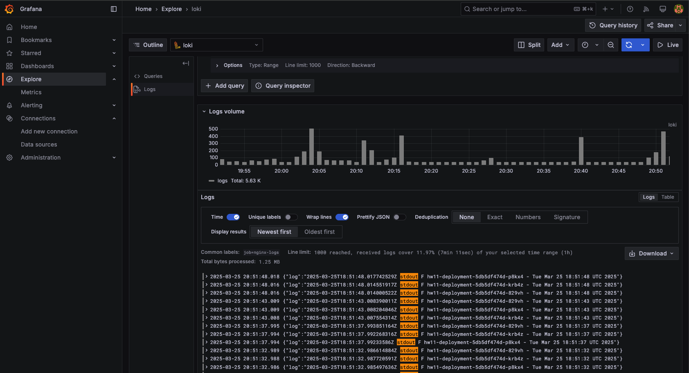
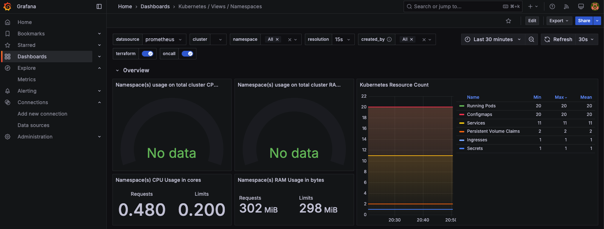
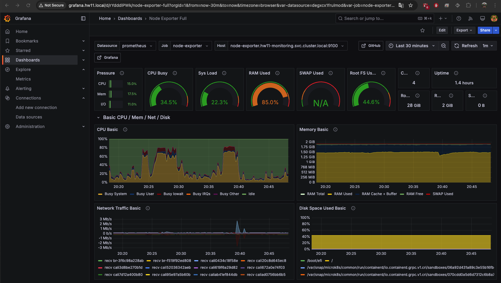

# HW11 Logs & Monitoring Deployment Guide

## 1. Створення namespace
```sh
microk8s.kubectl apply -f [namespace.yaml](namespace.yaml)
```

## 2. Розгортання Prometheus
```sh
microk8s.kubectl apply -f [monitoring/prometheus-config.yaml](monitoring/prometheus-config.yaml)
microk8s.kubectl apply -f [monitoring/prometheus-deployment.yaml](monitoring/prometheus-deployment.yaml)
microk8s.kubectl apply -f [monitoring/prometheus-service.yaml](monitoring/prometheus-service.yaml)
```

## 3. Розгортання Loki
```sh
microk8s.kubectl apply -f [loki/loki-config.yaml](loki/loki-config.yaml)
microk8s.kubectl apply -f [loki/loki-pv.yaml](loki/loki-pv.yaml)
microk8s.kubectl apply -f [loki/loki-pvc.yaml](loki/loki-pvc.yaml)
microk8s.kubectl apply -f [loki/loki-deployment.yaml](loki/loki-deployment.yaml)
microk8s.kubectl apply -f [loki/loki-service.yaml](loki/loki-service.yaml)
```

## 4. Розгортання Fluent Bit
```sh
microk8s.kubectl apply -f [fluent/fluent-bit-config.yaml](fluent/fluent-bit-config.yaml)
microk8s.kubectl apply -f [fluent/fluent-bit-deamonset.yaml](fluent/fluent-bit-deamonset.yaml)
```

## 5. Розгортання Grafana
```sh
microk8s.kubectl apply -f [grafana/grafana-deployment.yaml](grafana/grafana-deployment.yaml)
microk8s.kubectl apply -f [grafana/grafana-service.yaml](grafana/grafana-service.yaml)
microk8s.kubectl apply -f [grafana/grafana-ingress.yaml](grafana/grafana-ingress.yaml)
```

## 6. Розгортання kube-state-metrics і node-exporter
```sh
microk8s.kubectl apply -f [monitoring/kube-state-metrics.yaml](monitoring/kube-state-metrics.yaml)
microk8s.kubectl apply -f [monitoring/node-exporter.yaml](monitoring/node-exporter.yaml)
```

## 7. Розгортання тестового busybox
```sh
microk8s.kubectl apply -f [busybox/configmap.yaml](busybox/configmap.yaml)
microk8s.kubectl apply -f [busybox/pv.yaml](busybox/pv.yaml)
microk8s.kubectl apply -f [busybox/pvc.yaml](busybox/pvc.yaml)
microk8s.kubectl apply -f [busybox/deployment.yaml](busybox/deployment.yaml)
microk8s.kubectl apply -f [busybox/service.yaml](busybox/service.yaml)
```

## 8. Перевірка стану ресурсів
### Загальний стан в hw11-monitoring
```sh
microk8s.kubectl get all -n hw11-monitoring
```

```
NAME                                      READY   STATUS    RESTARTS   AGE
pod/fluent-bit-rljjq                      1/1     Running   2          178m
pod/grafana-85b785d45d-hjv9m              1/1     Running   2          164m
pod/kube-state-metrics-669cccd79c-dm86d   1/1     Running   2          141m
pod/loki-54d84d4bbb-l27qr                 1/1     Running   2          170m
pod/node-exporter-566d9                   1/1     Running   2          140m
pod/prometheus-58cd678dfc-5fchm           1/1     Running   0          22m

NAME                         TYPE        CLUSTER-IP       EXTERNAL-IP   PORT(S)          AGE
service/grafana              ClusterIP   10.152.183.67    <none>        3000/TCP         163m
service/kube-state-metrics   ClusterIP   10.152.183.50    <none>        8080/TCP         141m
service/loki                 ClusterIP   10.152.183.252   <none>        3100/TCP         169m
service/node-exporter        ClusterIP   10.152.183.137   <none>        9100/TCP         140m
service/prometheus-service   NodePort    10.152.183.121   <none>        9090:31232/TCP   3h14m

NAME                           DESIRED   CURRENT   READY   UP-TO-DATE   AVAILABLE   NODE SELECTOR   AGE
daemonset.apps/fluent-bit      1         1         1       1            1           <none>          178m
daemonset.apps/node-exporter   1         1         1       1            1           <none>          140m

NAME                                 READY   UP-TO-DATE   AVAILABLE   AGE
deployment.apps/grafana              1/1     1            1           164m
deployment.apps/kube-state-metrics   1/1     1            1           142m
deployment.apps/loki                 1/1     1            1           170m
deployment.apps/prometheus           1/1     1            1           3h14m

NAME                                            DESIRED   CURRENT   READY   AGE
replicaset.apps/grafana-85b785d45d              1         1         1       164m
replicaset.apps/kube-state-metrics-669cccd79c   1         1         1       141m
replicaset.apps/loki-54d84d4bbb                 1         1         1       170m
replicaset.apps/prometheus-58cd678dfc           1         1         1       3h14m

```

### Загальний стан в hw11
```sh
microk8s.kubectl get all -n hw11
```

```
NAME                                   READY   STATUS    RESTARTS   AGE
pod/hw11-deployment-5db5df474d-829vh   1/1     Running   2          136m
pod/hw11-deployment-5db5df474d-krb4z   1/1     Running   2          134m
pod/hw11-deployment-5db5df474d-p8kx4   1/1     Running   2          138m

NAME                   TYPE        CLUSTER-IP      EXTERNAL-IP   PORT(S)   AGE
service/hw11-service   ClusterIP   10.152.183.45   <none>        80/TCP    5d1h

NAME                              READY   UP-TO-DATE   AVAILABLE   AGE
deployment.apps/hw11-deployment   3/3     3            3           5d1h

NAME                                         DESIRED   CURRENT   READY   AGE
replicaset.apps/hw11-deployment-5879f59547   0         0         0       5d1h
replicaset.apps/hw11-deployment-5db5df474d   3         3         3       138m
replicaset.apps/hw11-deployment-5f657b4f9b   0         0         0       5d1h
replicaset.apps/hw11-deployment-6bf7585dfc   0         0         0       5d1h
replicaset.apps/hw11-deployment-864bd5ccfd   0         0         0       5d1h

NAME                                                  REFERENCE                    TARGETS              MINPODS   MAXPODS   REPLICAS   AGE
horizontalpodautoscaler.autoscaling/hw11-deployment   Deployment/hw11-deployment   cpu: <unknown>/50%   2         10        3          5d
```

### Перевірка Persistent Volume (PV)
```sh
microk8s.kubectl get pv
```

```
NAME      CAPACITY   ACCESS MODES   RECLAIM POLICY   STATUS   CLAIM                      STORAGECLASS        VOLUMEATTRIBUTESCLASS   REASON   AGE
hw11-pv   5Gi        RWO            Retain           Bound    hw11/busybox-pvc           microk8s-hostpath   <unset>                          5d1h
loki-pv   5Gi        RWO            Retain           Bound    hw11-monitoring/loki-pvc   loki-storage        <unset>                          176m
```


### Перевірка Persistent Volume Claim (PVC)
```sh
microk8s.kubectl get pvc -n hw11-monitoring
```

```
NAME       STATUS   VOLUME    CAPACITY   ACCESS MODES   STORAGECLASS   VOLUMEATTRIBUTESCLASS   AGE
loki-pvc   Bound    loki-pv   5Gi        RWO            loki-storage   <unset>                 176m
```

### Перевірка Endpoints
```sh
microk8s.kubectl get endpoints -n hw11-monitoring
```

```
NAME                 ENDPOINTS           AGE
grafana              10.1.243.227:3000   166m
kube-state-metrics   10.1.243.222:8080   145m
loki                 10.1.243.219:3100   173m
node-exporter        10.0.2.15:9100      144m
prometheus-service   10.1.243.211:9090   3h17m
```

## 9. Перевірка запису логу у файл без скейлінгу. 
### За замовчуванням 3 пода:
```sh
tail -f /mnt/data/busybox-logs/hw11-log.txt
```

```
hw11-deployment-5f657b4f9b-v9jqb - Thu Mar 20 17:07:47 UTC 2025
hw11-deployment-5f657b4f9b-62wj6 - Thu Mar 20 17:07:49 UTC 2025
hw11-deployment-5f657b4f9b-rc5s4 - Thu Mar 20 17:07:51 UTC 2025
hw11-deployment-5f657b4f9b-v9jqb - Thu Mar 20 17:07:52 UTC 2025
hw11-deployment-5f657b4f9b-62wj6 - Thu Mar 20 17:07:54 UTC 2025
hw11-deployment-5f657b4f9b-rc5s4 - Thu Mar 20 17:07:56 UTC 2025
```

### Скейлінг у більшу сторону:
```sh
microk8s.kubectl scale deployment hw11-deployment --replicas=5 -n hw11
tail -f /mnt/data/busybox-logs/hw11-log.txt
```

```
hw11-deployment-5f657b4f9b-v9jqb - Thu Mar 20 17:25:08 UTC 2025
hw11-deployment-5f657b4f9b-62wj6 - Thu Mar 20 17:25:10 UTC 2025
hw11-deployment-5f657b4f9b-rc5s4 - Thu Mar 20 17:25:12 UTC 2025
hw11-deployment-5f657b4f9b-f2lvt - Thu Mar 20 17:25:12 UTC 2025
hw11-deployment-5f657b4f9b-lsldm - Thu Mar 20 17:25:12 UTC 2025

hw11-deployment-5f657b4f9b-v9jqb - Thu Mar 20 17:25:13 UTC 2025
hw11-deployment-5f657b4f9b-62wj6 - Thu Mar 20 17:25:15 UTC 2025
hw11-deployment-5f657b4f9b-rc5s4 - Thu Mar 20 17:25:17 UTC 2025
hw11-deployment-5f657b4f9b-f2lvt - Thu Mar 20 17:25:17 UTC 2025
hw11-deployment-5f657b4f9b-lsldm - Thu Mar 20 17:25:17 UTC 2025
```

### Скейлинг в меншу сторону:
```sh
microk8s.kubectl scale deployment hw11-deployment --replicas=2 -n hw11
tail -f /mnt/data/busybox-logs/hw11-log.txt
```

```
hw11-deployment-5f657b4f9b-v9jqb - Thu Mar 20 17:25:18 UTC 2025
hw11-deployment-5f657b4f9b-62wj6 - Thu Mar 20 17:25:20 UTC 2025

hw11-deployment-5f657b4f9b-v9jqb - Thu Mar 20 17:25:23 UTC 2025
hw11-deployment-5f657b4f9b-62wj6 - Thu Mar 20 17:25:25 UTC 2025

hw11-deployment-5f657b4f9b-v9jqb - Thu Mar 20 17:25:28 UTC 2025
hw11-deployment-5f657b4f9b-62wj6 - Thu Mar 20 17:25:30 UTC 2025
```

## 10. Налаштування та перевірка автоскейлінгу:
```sh
microk8s.kubectl autoscale deployment hw11-deployment --cpu-percent=50 --min=2 --max=10 -n hw11
microk8s.kubectl get hpa -n hw11
```

```
NAME              REFERENCE                    TARGETS              MINPODS   MAXPODS   REPLICAS   AGE
hw11-deployment   Deployment/hw11-deployment   cpu: <unknown>/50%   2         10        3          5d1h
```

## 11. Screenshots

### 1️⃣ Логи з BusyBox у Loki


### 2️⃣ Моніторинг Namespaces у Prometheus


### 3️⃣ Моніторинг вузлів через Node Exporter
